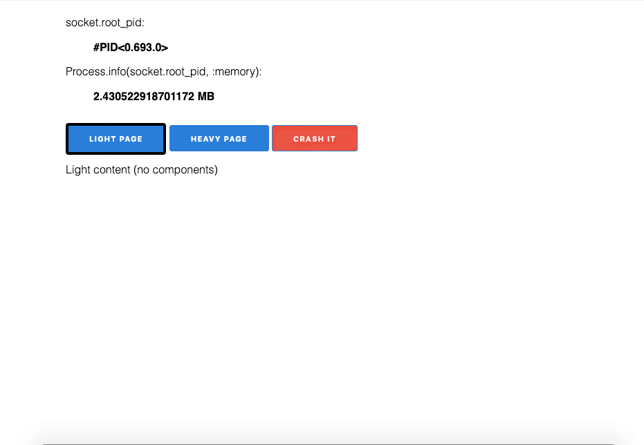

# Compo

LiveComponent memory usage.
The total memory usage for "assigns" is:  
`liveview's "assigns" + live_component's "assigns"`

At first the initial memory use is ~ 2.4 MB, that corresponds to `liveview's "assigns"`, and then we visit "heavy page", the memeory adds up to ~4.9 MB. Going back to "light page" does not free memory back to 2.4 MB. Except we crash the process.

This is only 1 process (1 browser tab opened). 100 concurrent users would add up, if it goes linear, to ~490 MB of memory usage.

_Note: this demo does not show when the latter assigns in memory will be freed while the process is still alive_
